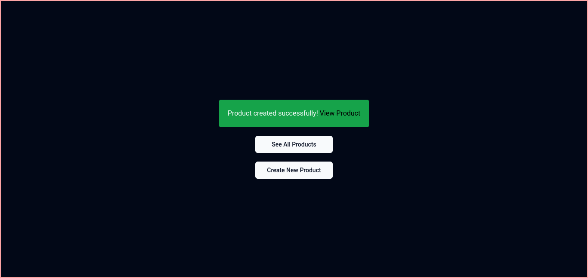

# Sahayata Assignment

## Live Project Links

- [Products Frontend](https://your-frontend-project-link.com)
- [Orders Frontend](https://your-frontend-project-link.com)

## Technology Used

- Next.js
- React.js
- Tailwind CSS
- FastAPI

### ShadCNs UI Components Used

- Button
- Input
- Select
- Table
- Pagination
- Toast
- Toggle
- Dropdown Menu
- Dark Theme

## Instructions for Running Project Locally

1. Clone the repository:

   ```bash
   git clone https://github.com/aviralsharma07/sahayak.git
   cd sahayak
   ```

2. Install the dependencies:

   ```bash
   npm install
   ```

3. Run the development server:

   ```bash
    npm run dev
   ```

4. Open [http://localhost:3000](http://localhost:3000) in your browser.

# Screenshots of the Project

### List Products


### Create a Product




### Update a Product


### Delete Products

- Single Product can be deleted by clicking on the `Delete` button.
- Multiple Products can be deleted by selecting the checkbox and clicking on the `Delete Selected` button.


### List Orders


### Create an Order


### Update an Order


### Delete/Cancel an Order

- Single Order can be deleted by clicking on the `Delete` button.


